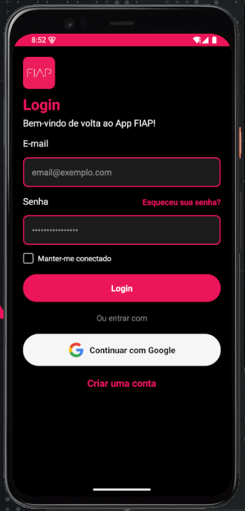

<div align="center">



# Mobile App — FIAP

Aplicação mobile desenvolvida com **React Native** e **TypeScript** como projeto prático do curso de desenvolvimento mobile da **FIAP**.


</div>

---

## 👨‍💻 Autores

Desenvolvido por: 
- Arthur Cotrick RM554510
- Ryan Brito RM554497
- Diogo Leles RM558487
- Vitor Chaves RM557067
---

## 📋 Índice

- [Sobre o Projeto](#-sobre-o-projeto)
- [Funcionalidades](#-funcionalidades)
- [Layout e Identidade Visual](#-layout-e-identidade-visual)
- [Tecnologias e Dependências](#-tecnologias-e-dependências)
- [Estrutura do Projeto](#-estrutura-do-projeto)
- [Componentes](#-componentes)
- [Dados Mock](#-dados-mock)
- [Pré-requisitos](#-pré-requisitos)
- [Instalação e Execução](#-instalação-e-execução)
- [Autor](#-autor)

---

## 📖 Sobre o Projeto

O **Mobile App FIAP** é uma aplicação mobile desenvolvida com **React Native**, **TypeScript** e **Expo**. O projeto implementa uma tela de autenticação completa com a identidade visual da FIAP, servindo como base para um app institucional da faculdade.

O foco do desenvolvimento está na criação de uma interface moderna e funcional, aplicando boas práticas de componentização, tipagem estática com TypeScript e o uso de APIs nativas do React Native para layout responsivo em diferentes dispositivos.

---

## ✨ Funcionalidades

- **Login com e-mail e senha** — campos de entrada estilizados com a identidade visual da FIAP
- **Manter conectado** — checkbox customizado que persiste a preferência do usuário
- **Esqueceu sua senha** — botão de recuperação de acesso
- **Login com Google** — autenticação alternativa via conta Google
- **Criar uma conta** — link de redirecionamento para o cadastro
- **Safe Area** — layout adaptado automaticamente para diferentes modelos de dispositivo (notch, Dynamic Island, barra de navegação)

---

## 🎨 Layout e Identidade Visual

O design segue rigorosamente a paleta de cores da FIAP:

| Token | Hex | Uso |
|---|---|---|
| `primary` | `#ED145B` | Cor principal — bordas, botões, títulos e status bar |
| `background` | `#000000` | Fundo da aplicação |
| `surface` | `#1A1A1A` | Fundo dos campos de input |
| `text` | `#FFFFFF` | Textos e labels |
| `placeholder` | `#999999` | Texto de placeholder nos inputs |
| `google-bg` | `#F6F6F6` | Fundo do botão de login com Google |

A status bar é configurada com estilo `light` e fundo `#ED145B`, garantindo consistência visual desde o topo do dispositivo.

---

## 🛠️ Tecnologias e Dependências

| Pacote | Descrição |
|---|---|
| `react-native` | Framework base para desenvolvimento mobile multiplataforma |
| `expo` | Plataforma de build, desenvolvimento e deploy |
| `expo-status-bar` | Controle customizado da status bar nativa |
| `react-native-safe-area-context` | Adaptação automática de layout para áreas seguras do dispositivo |
| `typescript` | Tipagem estática para maior segurança e manutenibilidade do código |

---

## 📂 Estrutura do Projeto

```
mobile_app_fiap/
│
├── assets/
│   ├── fiap_logo.png         # Logotipo da FIAP
│   └── google.png            # Ícone do Google para o botão de OAuth
│
├── components/
│   └── Checkbox.tsx          # Componente reutilizável de checkbox customizado
│
├── App.tsx                   # Componente raiz — tela de login
├── index.ts                  # Ponto de entrada e registro do app no Expo
├── app.json                  # Configurações do projeto Expo (nome, slug, ícone)
├── tsconfig.json             # Configurações do compilador TypeScript
├── package.json              # Dependências e scripts do projeto
└── .gitignore                # Arquivos e pastas ignorados pelo Git
```

---

## 🧩 Componentes

### `CheckboxLogin` — `components/Checkbox.tsx`

Checkbox totalmente customizado, sem dependências externas. Desenvolvido do zero com `TouchableOpacity` e `View` para controlar a preferência de **"Manter-me conectado"** na tela de login.

**Interface (Props):**

```typescript
interface CheckBoxLoginInterface {
  keepConnected: boolean;
  setKeepConnected: React.Dispatch<React.SetStateAction<boolean>>;
}
```

| Prop | Tipo | Descrição |
|---|---|---|
| `keepConnected` | `boolean` | Estado atual do checkbox (marcado ou desmarcado) |
| `setKeepConnected` | `Dispatch<SetStateAction<boolean>>` | Função para alternar o estado |

**Comportamento visual:**

- **Desmarcado:** borda cinza (`#999`), fundo transparente
- **Marcado:** fundo rosa FIAP (`#ED145B`), exibe ícone `✓` em branco

**Exemplo de uso:**

```tsx
import { CheckboxLogin } from './components/Checkbox';

const [keepConnected, setKeepConnected] = useState(false);

<CheckboxLogin
  keepConnected={keepConnected}
  setKeepConnected={setKeepConnected}
/>
```

---

## ✅ Pré-requisitos

Antes de começar, certifique-se de ter instalado:

- [Node.js](https://nodejs.org/) — versão **18** ou superior
- [npm](https://www.npmjs.com/) ou [Yarn](https://yarnpkg.com/)
- [Expo Go](https://expo.dev/go) no dispositivo físico **ou** um emulador Android/iOS configurado

---

## 🚀 Instalação e Execução

### 1. Clone o repositório

```bash
git clone https://github.com/ryanbritodev/mobile_app_fiap.git
cd mobile_app_fiap
```

### 2. Instale as dependências

```bash
npm install
```

### 3. Inicie o servidor de desenvolvimento

```bash
npx expo start
```

Após iniciar, um **QR Code** será exibido no terminal. Escaneie-o com o app **Expo Go** para abrir o projeto no seu dispositivo.

### Outros comandos disponíveis

```bash
# Rodar no emulador Android
npx expo start --android

# Rodar no simulador iOS (requer macOS)
npx expo start --ios

# Rodar no navegador
npx expo start --web
```

<div align="center">
  <sub>Projeto acadêmico · Desenvolvimento Mobile · FIAP </sub>
</div>
